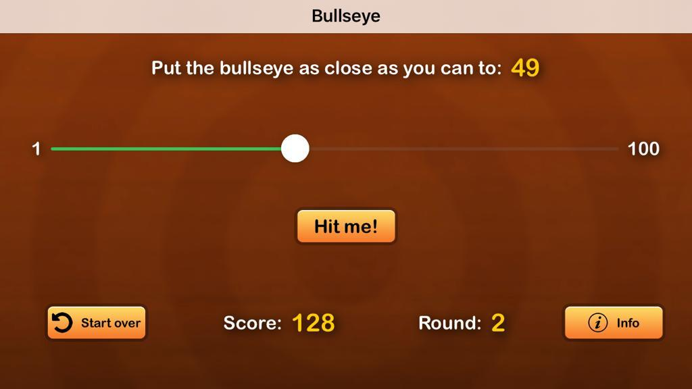
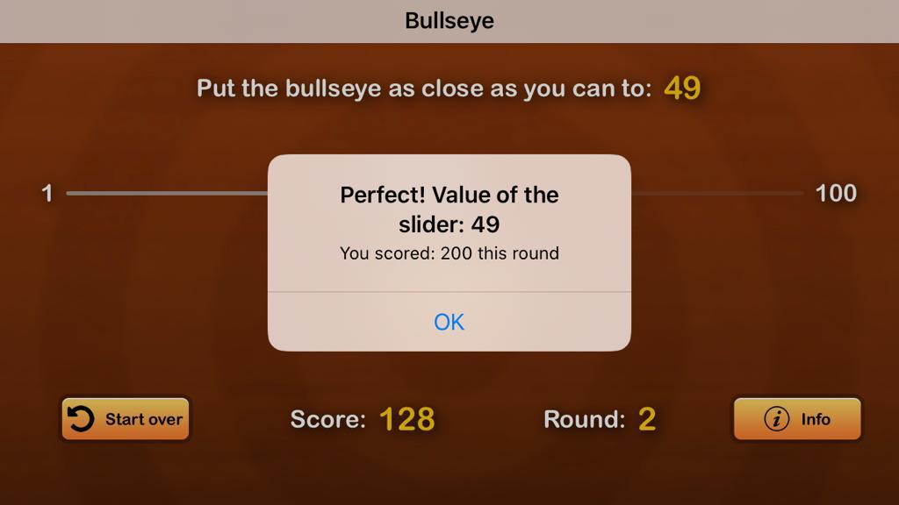
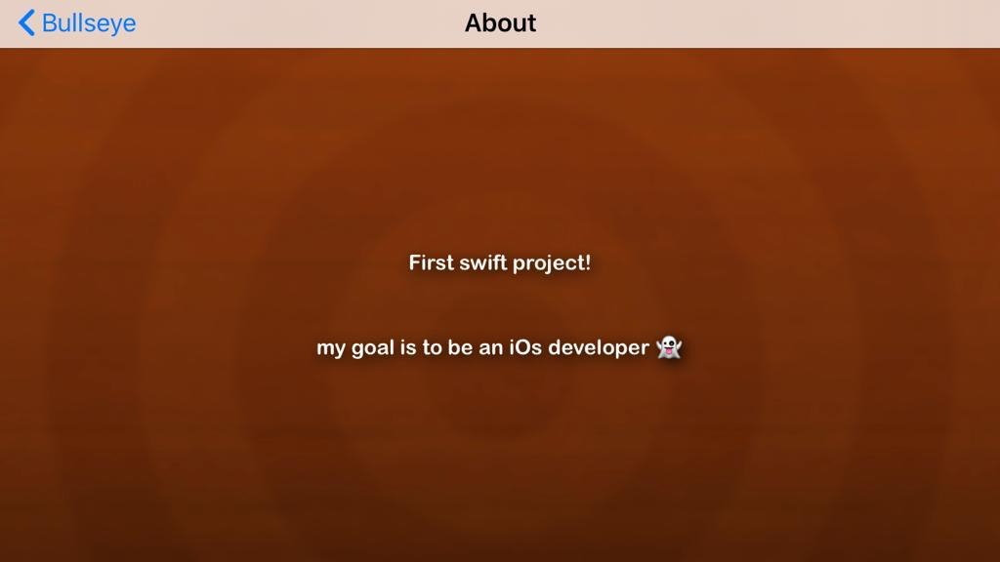

# Project Name
> Bullseye

## Table of contents
* [General info](#general-info)
* [Screenshots](#screenshots)
* [Technologies](#technologies)
* [Setup](#setup)
* [Features](#features)
* [Status](#status)
* [Contact](#contact)

## General info
First Swift project, focusing on the new SwiftUI, my goal is to be a iOs developer :D

## Screenshots

## Technologies
* Xcode 11
* SwiftUI
* iOS 13

## Setup
Just clone and open in Xcode, then run

## Features
* Get a close value using the slider with the random value generated each round

## Status
Project is: finished

## Inspiration
Project based on: https://www.raywenderlich.com/4919757-your-first-ios-and-swiftui-app

## Contact
Created by [@jorgepezzuol](https://www.linkedin.com/in/jorge-pezzuol/) - feel free to contact me!
